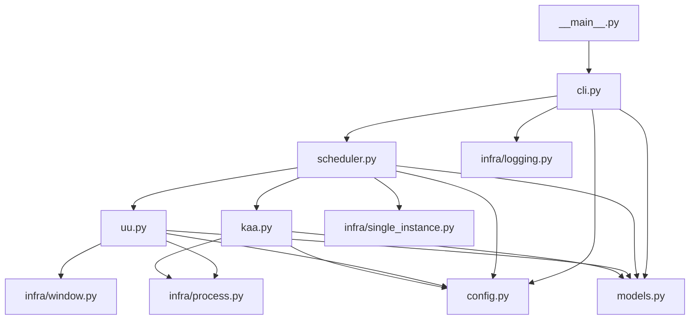

# 学偶日常调度器程序框架设计

更新日期：2026-06-03

## 文档目标

本文档定义第一版 Python 调度器的推荐程序框架，重点回答以下问题：

1. 项目应拆成哪些 Python 文件
2. 这些文件之间如何直接引用
3. 每个文件分别负责什么
4. 第一版哪些文件确实有必要存在

本次版本以“尽量简洁”为原则，只保留当前阶段真正必要的文件。

## 这次调整的核心结论

相对于上一版框架，本次确认了两点：

1. 原来的 `orchestrator.py` 改名为 `scheduler.py`
2. 第一版不再预建过多模块，只保留最小可用骨架

这里的 `scheduler.py` 指程序内部的主流程调度器。

Windows 任务计划程序仍然是外部调度工具，两者不是同一个概念。

## 设计原则

第一版框架应满足以下原则：

- 单一入口，所有执行都从一个 Python 入口开始
- 主流程集中，完整流程只放在一个 `scheduler.py` 中
- UU 和 kaa 各自只保留一个业务文件，先不要过度拆分
- 底层公共能力只抽取真正复用的部分
- 先跑通主链路，再考虑 OCR、配置覆盖、失败截图等增强能力

## 推荐目录结构

建议第一版采用下面这套极简结构：

```text
6.kaa-scheduler/
├─ generated_by_ai/
│  ├─ 260603-0-requirements.md
│  └─ 260603-1-program-framework.md
├─ app/
│  └─ kaa_scheduler/
│     ├─ __init__.py
│     ├─ __main__.py
│     ├─ cli.py
│     ├─ scheduler.py
│     ├─ config.py
│     ├─ models.py
│     ├─ uu.py
│     ├─ kaa.py
│     └─ infra/
│        ├─ __init__.py
│        ├─ logging.py
│        ├─ process.py
│        ├─ window.py
│        └─ single_instance.py
├─ scripts/
│  ├─ run_manual.ps1
│  └─ install_task_scheduler.ps1
├─ logs/
└─ tests/
   ├─ test_scheduler.py
   ├─ test_uu.py
   └─ test_kaa.py
```

## 为什么收敛到这套结构

当前项目的真实目标不是做一个通用自动化框架，而是尽快稳定跑通这条固定主链路：

```text
启动 UU -> 确保目标游戏加速 -> 启动 kaa -> 等待 kaa 退出 -> 停止 UU 加速
```

在这个阶段，如果提前拆出：

- `constants.py`
- `exceptions.py`
- `runtime_context.py`
- `template_matcher.py`
- `screen_capture.py`
- `task_scheduler.py`
- `paths.py`

会让结构看起来完整，但会增加维护成本，而且很多文件短期内并不会真正承载复杂逻辑。

因此更合适的做法是：

- 先把能明确复用的底层能力抽出来
- 业务逻辑先尽量合并
- 等复杂度真的长出来，再做第二轮拆分

## 文件分组说明

虽然文件数量已经收缩，但仍然保留一个很浅的分组：

### 顶层入口与核心文件

- `__main__.py`
- `cli.py`
- `scheduler.py`
- `config.py`
- `models.py`
- `uu.py`
- `kaa.py`

### 底层公共能力

- `infra/logging.py`
- `infra/process.py`
- `infra/window.py`
- `infra/single_instance.py`

这样做的目的，是让顶层文件一眼能看完，同时把真正的底层工具隔离出去。

## 每个文件为什么有必要存在

下面逐个说明这套最小骨架里每个文件存在的理由。

### `app/kaa_scheduler/__main__.py`

职责：

- 提供 `python -m kaa_scheduler` 入口
- 只负责调用 `cli.main()`

为什么保留：

- 它非常薄，但能保证入口稳定
- 后续不管是手动运行、计划任务运行，还是打包，都更方便

### `app/kaa_scheduler/cli.py`

职责：

- 解析命令行参数
- 提供手动启动入口
- 构造运行配置
- 调用 `scheduler.py`
- 返回退出码

为什么保留：

- 如果不单独保留，入口逻辑和调度逻辑会混在一起
- 后续加调试参数、探针模式时，这个文件会很自然地承接

第一版建议参数保持很少：

- `run`：执行一次完整流程
- `probe-uu`：只验证 UU 探针
- `probe-kaa`：只验证 kaa 启动和等待退出
- `--timeout`：覆盖默认超时
- `--log-level`：覆盖默认日志级别

### `app/kaa_scheduler/scheduler.py`

职责：

- 定义主流程
- 串联 UU 和 kaa
- 统一处理超时、失败、退出码
- 汇总运行结果

为什么保留：

- 这是整个项目的核心文件
- 如果没有它，流程会散到 `cli.py`、`uu.py`、`kaa.py` 中

第一版推荐主流程：

1. 初始化日志
2. 获取单实例锁
3. 检查或启动 UU
4. 确保 UU 已加速学园偶像大师
5. 启动 kaa
6. 等待 kaa 退出或超时
7. 正常完成时停止 UU 加速
8. 输出结果

### `app/kaa_scheduler/config.py`

职责：

- 定义调度器自己的配置
- 提供默认路径、超时、窗口标题、目标游戏名
- 统一管理运行时会用到的参数

为什么保留：

- 路径和超时不能散在多个文件里写死
- 后续如果改 exe 路径、日志目录、默认超时，只改一个地方

第一版建议承载这些内容：

- UU 启动路径
- kaa 启动路径
- kaa 工作目录
- UU 窗口标题
- 目标游戏名称
- 默认超时时间
- 日志目录

第一版不建议让 `config.py` 直接改 kaa 的 `config.json`。

### `app/kaa_scheduler/models.py`

职责：

- 定义跨模块共享的数据结构
- 让结果、状态和参数传递保持清晰

为什么保留：

- 如果不用它，后续很容易退化成到处传 `dict` 或零散变量
- 它可以很小，但值得存在

第一版建议只保留少量模型：

- `RunOptions`
- `RunResult`
- `UuStatus`
- `KaaStatus`

### `app/kaa_scheduler/uu.py`

职责：

- 封装所有和 UU 有关的业务动作
- 对 `scheduler.py` 提供高层语义接口

建议提供的方法：

- `ensure_started()`
- `attach_window()`
- `get_status()`
- `ensure_target_accelerating()`
- `stop_target_acceleration()`

为什么保留为单文件：

- 第一版没有必要先拆成 `controller.py`、`driver_uia.py`、`driver_image.py`
- 只有当搜索页、模板匹配和控件定位逻辑明显变复杂时，再拆分才划算

### `app/kaa_scheduler/kaa.py`

职责：

- 封装 kaa 的启动和等待退出逻辑
- 屏蔽工作目录、子进程启动和超时细节

建议提供的方法：

- `launch()`
- `wait_until_finish()`
- `is_running()`

为什么保留为单文件：

- 第一版只需要把 kaa 当作一个受控进程
- 当前还没确认 CLI 和配置覆盖细节，不值得提前拆成多个文件

## `infra/` 目录为什么只保留 4 个文件

这一层只抽取“明确有复用价值”的公共能力。

### `app/kaa_scheduler/infra/logging.py`

职责：

- 初始化日志
- 统一日志格式
- 统一日志输出位置

为什么保留：

- 日志初始化不应该塞进 `cli.py` 或 `scheduler.py`
- 这是非常确定会复用的公共能力

### `app/kaa_scheduler/infra/process.py`

职责：

- 查找进程
- 启动进程
- 等待进程启动
- 等待进程退出

为什么保留：

- UU 和 kaa 都会用到进程相关逻辑
- 这部分天然属于底层通用能力

### `app/kaa_scheduler/infra/window.py`

职责：

- 封装窗口附着、激活、查找、输入、点击等桌面自动化基础动作
- 向 `uu.py` 提供通用窗口操作能力

为什么保留：

- 即使第一版主要服务 UU，这部分逻辑也不该直接塞进 `uu.py`
- 后续如果补 kaa 的 GUI 启动按钮，也能直接复用

### `app/kaa_scheduler/infra/single_instance.py`

职责：

- 防止脚本重复运行
- 避免定时触发和手动运行同时进入主流程

为什么保留：

- 这是很独立的横切逻辑
- 不应该混进 `scheduler.py`

## 这次明确不预建的文件

为了保持简洁，下面这些文件当前阶段都不建议预先创建：

- `constants.py`
- `exceptions.py`
- `runtime_context.py`
- `screen_capture.py`
- `template_matcher.py`
- `task_scheduler.py`
- `paths.py`

原因不是它们永远不需要，而是当前还没有足够复杂度来支撑这些拆分。

更具体地说：

- 常量先并入 `config.py`
- 少量异常先在对应文件内局部定义，或者暂时直接使用内建异常
- 路径管理先放进 `config.py`
- 截图和模板匹配等真的需要时再拆出独立模块
- Windows 任务计划程序安装先放在 PowerShell 脚本里，不需要 Python 模块承接

## 推荐的直接引用关系

第一版建议的 import 关系如下：



## 推荐的调用链

建议主调用链保持非常清晰：

```text
__main__.py
  -> cli.py
    -> infra/logging.py
    -> config.py
    -> scheduler.py
      -> infra/single_instance.py
      -> uu.py
        -> infra/process.py
        -> infra/window.py
      -> kaa.py
        -> infra/process.py
```

这条链路有两个目标：

- 让入口足够薄
- 让调度逻辑只有一个中心

## 第一版不再继续砍文件的原因

如果继续压缩，还可以把 `models.py` 或 `infra/` 再合并掉，但那样会开始破坏清晰度。

例如：

- 把日志初始化塞进 `cli.py`，入口会很快变脏
- 把窗口操作塞进 `uu.py`，业务逻辑和底层实现会混在一起
- 把单实例锁塞进 `scheduler.py`，主流程会越来越杂

所以当前这 8 个顶层文件加 4 个基础设施文件，已经是“尽量简洁但仍然清晰”的平衡点。

## 后续何时再拆分

只有在下面这些情况出现时，才建议做第二轮拆分：

1. `uu.py` 同时承载 UIA、模板匹配、搜索页定位，长度明显失控
2. `kaa.py` 开始同时承载 CLI 启动、配置覆盖、日志解析等多种职责
3. 需要失败截图和模板匹配，底层图像逻辑明显增长

到那时，再考虑把：

- `uu.py` 拆成 `controller + driver`
- `kaa.py` 拆成 `process + config_patch`
- `infra/window.py` 旁边补 `screen_capture.py` 和 `template_matcher.py`

## 当前结论

本次更新后，第一版推荐框架收敛为：

- 主流程文件改名为 `scheduler.py`
- 顶层业务文件只保留 `uu.py` 和 `kaa.py`
- 底层公共能力只保留 `logging.py`、`process.py`、`window.py`、`single_instance.py`
- 所有暂时没有明确必要性的文件，先不创建

这套结构更符合当前阶段的目标：

- 足够清晰
- 足够少
- 能直接开工
- 后续仍然有扩展空间
